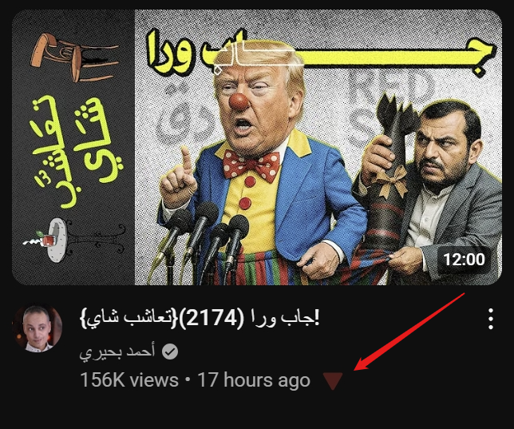

# P48-Protocol (Web-MPV-Linker) 🚀

Welcome to **P48-Protocol (Web-MPV-Linker)** – a lightweight and super-easy way to open videos directly in your external player like **mpv**. This tool consists of a browser extension and a Python-based protocol handler that work together to make launching videos in `mpv` a breeze.

## 🌐 Table of Contents

- [P48-Protocol (Web-MPV-Linker) 🚀](#p48-protocol-web-mpv-linker-)
  - [🌐 Table of Contents](#-table-of-contents)
  - [🌟 Features](#-features)
  - [✅ Prerequisites](#-prerequisites)
  - [🚀 Installation Guide](#-installation-guide)
    - [1. Install MPV & yt-dlp](#1-install-mpv--yt-dlp)
    - [2. Set Up the Browser Extension](#2-set-up-the-browser-extension)
    - [3. Configure the Protocol Handler](#3-configure-the-protocol-handler)
      - [🪟 Windows Setup](#-windows-setup)
      - [🐧 Linux Setup](#-linux-setup)
  - [📌 How to Use](#-how-to-use)
    - [Quick Start](#quick-start)
    - [Manually Add Links & Set Quality (Popup)](#manually-add-links--set-quality-popup)
  - [⚙️ Development Guide](#️-development-guide)
  - [🤝 Contributing](#-contributing)
  - [📜 License](#-license)

## 🌟 Features

- 🚀 **Instant Video Launch**: One-click playback of YouTube videos (including Shorts) in `mpv`.
- 🔗 **Custom Protocol**: Defines a `P48://` URL scheme to launch videos directly in your external player (default: `mpv`).
- ⚙️ **Quality Selection**: Choose your preferred video quality (e.g., 1080p, 720p, Best) via the extension popup. The handler will attempt to play at this quality or the best available lower one. This preference is saved and used by inline buttons too.
- 🖱️ **Inline Buttons**: A small `🔻` button next to each YouTube video or Short for easy access.
- 💡 **Cross-Platform Support**: Works seamlessly on both Windows and Linux.

## ✅ Prerequisites

- **`mpv` Video Player**: Ensure it’s installed and available in your system PATH.

  - [Get mpv here](https://mpv.io/installation/)

- **`yt-dlp`**: **Highly recommended** for the quality selection feature to work effectively and for reliable playback of web videos. `mpv` often relies on `yt-dlp` (or the older `youtube-dl`) for web video playback. Ensure `yt-dlp` is installed and in your system PATH.
  - [Get yt-dlp here](https://github.com/yt-dlp/yt-dlp)
- **Compatible Browser**:

  - Firefox-based browsers (like Firefox, Zen).
  - Chromium-based browsers (like Chrome, Edge).

- **Windows Requirements:**

  - `protocol-registrer.exe` and `P48.exe` must be in the same directory. ([Download P48-WIN.zip](https://github.com/MDallah/p48-protocol-web-mpv-linker/releases))

- **Linux Requirements:**

  - `protocol-registrer.bin` and `P48.bin` must be in the same directory. ([Download P48-LINUX.zip](https://github.com/MDallah/p48-protocol-web-mpv-linker/releases))

## 🚀 Installation Guide

### 1. Install MPV & yt-dlp

Make sure `mpv` and `yt-dlp` are installed and working on your system and are accessible via your system's PATH.

### 2. Set Up the Browser Extension

1. Go to your browser’s Extensions page (e.g., `chrome://extensions` or `about:addons`).
2. Enable **Developer Mode**.
3. Click **Load Unpacked** and select the `extension/` directory.
4. Make sure the extension is enabled and has the necessary permissions.

### 3. Configure the Protocol Handler

#### 🪟 Windows Setup

1. Download the `P48-WIN.zip` file and extract it. ([Download](https://github.com/MDallah/p48-protocol-web-mpv-linker/releases))
2. Right-click `protocol-registrer.exe` and choose **Run as Administrator**.
3. Confirm the `p48://` protocol registration (overwrite if prompted).
4. Ensure `P48.exe` is in the same folder as `protocol-registrer.exe`.

#### 🐧 Linux Setup

1. Download and extract the `P48-LINUX.zip` file. ([Download](https://github.com/MDallah/p48-protocol-web-mpv-linker/releases))
2. Run the command:

   ```bash
   sudo ./protocol-registrer.bin
   ```

3. Confirm the `p48://` protocol registration (overwrite if prompted).
4. Ensure `P48.bin` is in the same folder as `protocol-registrer.bin`.

## 📌 How to Use

### Quick Start

1. Open YouTube.
2. Click the red `🔻` button next to any video or Short.

   - The button will appear next to the view count of each video.

     

3. The video will automatically open in `mpv`, attempting to use your saved quality preference.

### Manually Add Links (Popup)

1. Click the extension icon in your browser toolbar.
2. Paste any video URL.
3. Click **Submit** to open it in `mpv`.

## ⚙️ Development Guide

- **Building Executables:** Use [Nuitka](https://nuitka.net/):

```bash
python -m nuitka --standalone --onefile --remove-output protocol-registrer.py
```

- Optional Icons:

  - Windows: `--windows-icon-from-ico='.../icon.png'`
  - Linux: `--linux-icon='.../icon.png'`

## 🤝 Contributing

We love contributions! Feel free to open an issue or send a pull request.

## 📜 License

This project is licensed under the MIT License. See the [LICENSE](LICENSE) file for details.
